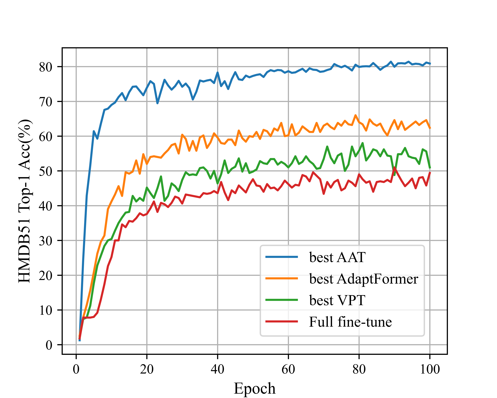

# AAT: Attribute-prompted Adapter Tuning for Efficient Video Action Recognition

<p align="center"></p>

## Installation

- Create a conda environment: ```conda create -n aat python=3.9```
- Install PyTorch 1.7.1+ and Torchvision 0.8.2+ 
- ```pip3 install -r requirements.txt```

## Dataset setup

```bash
${ROOT}/
|-- data
|   |-- UCF101
|   |-- HMDB51
|   |-- SthSthV2

```

## Download pretrained model

The pretrained model can be found in [here](), please download it and put it in the ```'./checkpoint/pretrained'``` directory of the corresponding baseline methods.  

## Train the model

To train on a model:

```bash
python train.py --config-file config_mae.yaml
```


## Citation

If you find our work useful in your research, please consider citing:

## Licence

This project is licensed under the terms of the MIT license.
